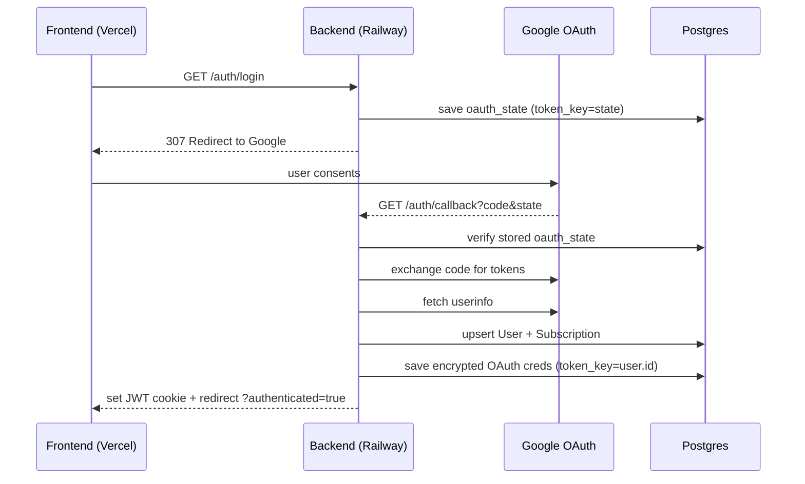
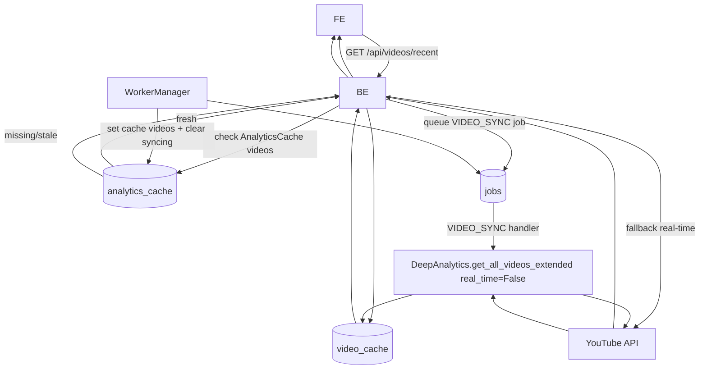
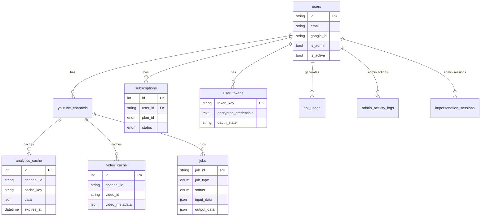

---
title: System Architecture
description: End-to-end architecture for TubeGrow (tubegrow.io).
---you tell me I think should only be tubegrow if not I feel people will abuse it and on widget how ever you think is Best But we need name and email first idk if we need a database or or supa base

# TubeGrow – Architecture

Frontend runs on Vercel (Next.js App Router).
Backend runs on Railway (FastAPI + background workers).
Primary external services: Google OAuth/YouTube APIs, OpenAI, Stripe (disabled during waitlist-only), Resend (waitlist emails).

**Status context (Dec 2025):** waitlist-only early access. Public UX must not show pricing.

## High-level module map

```mermaid
mindmap
  root((tubegrow.io))
    frontend(Next.js 16)
      marketing(Public marketing)
        pages(Landing + pillars + niches)
        blog(/blog + /blog/[slug])
        tools(/tools/* lite)
        seo(robots.txt + sitemap.xml + rss.xml + llms.txt)
      app(Authenticated product)
        dashboard(/dashboard + insights)
        analysis(/analysis + deep-analysis)
        settings(/settings/*)
        onboarding(/onboarding)
      admin(Internal panel /admin/*)
      lib(ApiClient + blogPosts)
      hooks(Auth + data loaders)
      components(UI)
      public(icons + manifest + llms.txt)
    backend(FastAPI)
      auth(OAuth + JWT cookies)
      routers(/api/*)
      tools(Domain logic)
      agents(AI orchestration)
      scripts(Local CLIs e.g. seo_report)
      workers(DB-backed async jobs)
      db(Postgres/SQLite models + repos)
      billing(Stripe - disabled during waitlist-only)
      services(Resend)
```

## Deployment topology

```mermaid
flowchart LR
  U[User Browser]
  C[Search/AI Crawlers<br/>Googlebot + LLM crawlers]
  V[Vercel Frontend<br/>Next.js]
  R[Railway Backend<br/>FastAPI]
  PG[(Railway Postgres)]
  G[Google OAuth + YouTube APIs]
  GA[GA4 + Search Console APIs<br/>(internal SEO reporting)]
  OAI[OpenAI API]
  S[Stripe API<br/>(billing disabled while waitlist-only)]
  RS[Resend API<br/>(waitlist emails)]
  CLI[SEO Report CLI<br/>(local)]

  U --> V
  C -->|crawl: sitemap.xml, robots.txt, rss.xml, llms.txt| V
  V -->|HTTPS + cookies| R
  R --> PG
  R --> G
  CLI -.-> GA
  R --> OAI
  R --> S
  R -.-> RS
```

## Authentication flow (multi-tenant SaaS)



Notes:
- OAuth credentials are stored per-user in `user_tokens` and encrypted via Fernet (`TOKEN_ENCRYPTION_KEY`).
- Session is a signed JWT cookie (`SESSION_COOKIE_NAME`) with `sub=user_id`.

## Request/analysis flow

```mermaid
flowchart TD
  FE[Frontend] -->|POST /api/analysis/deep/start| BE
  BE -->|create Job| J[(jobs)]
  BE --> FE
  W[WorkerManager poll loop] --> J
  W -->|DEEP_ANALYSIS handler| T[DeepAnalytics/CausalAnalytics]
  T -->|YouTube API via creds| YT[YouTube]
  T -->|result| AC[(analytics_cache)]
  W -->|update status| J
  FE -->|poll /status/{job_id}| BE --> J
  FE -->|GET /deep/cached| BE --> AC
```

## Video ETL flow



## Core data model (simplified)



## Production requirements

- Railway `api` service env:
  - `ENVIRONMENT=production`, `DEBUG=false`, `SINGLE_USER_MODE=false`
  - `DATABASE_URL` (Railway Postgres) – required for persistence
  - `GOOGLE_CLIENT_ID`, `GOOGLE_CLIENT_SECRET`
  - `SECRET_KEY` (JWT signing)
  - `TOKEN_ENCRYPTION_KEY` (Fernet)
  - `OPENAI_API_KEY`
  - Stripe vars only if billing is enabled (waitlist-only keeps billing UI off).
- Vercel env:
  - `NEXT_PUBLIC_SITE_URL=https://www.tubegrow.io`
  - `NEXT_PUBLIC_API_URL` (Railway backend URL, e.g. `https://<railway-service>.up.railway.app`)
  - `NEXT_PUBLIC_GA_ID` (GA4 measurement id)
  - Supabase waitlist vars if used.

Local-only (internal) SEO reporting:
- Uses Desktop OAuth env vars `SEO_OAUTH_CLIENT_JSON_PATH`, `GA4_PROPERTY_ID`, `GSC_PROPERTY`.
- Runs via `backend/scripts/seo_report.py` on a developer machine and is not deployed to Vercel/Railway.

## Where to look

- Backend API surface: `backend/app/routers/*`
- Core analytics: `backend/app/tools/deep_analytics.py`, `backend/app/tools/causal_analytics.py`
- Jobs/ETL: `backend/app/workers/*`, `backend/app/db/repository.py`
- Frontend pages: `frontend/app/*`
- Shared API client: `frontend/lib/api.ts`
